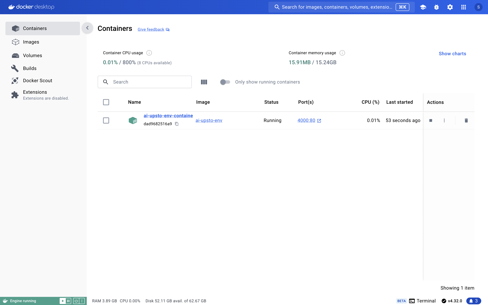

# AI Project Docker Environment

## Milestone 1: Docker Basics and Development Environment

### Docker Installation Instructions

1. I downloaded Docker Desktop from the official Docker website: [Docker Desktop](https://www.docker.com/products/docker-desktop)
2. I followed the installation wizard to install Docker on my system.
3. After installation, I started Docker Desktop.
4. I verified the installation by running `docker --version` in the terminal.

### Creating and Running a Docker Container

1. I pulled the Python 3.12 image using: docker pull python:3.12
2. I build a new image in docker using: docker build -t ai-upsto-env .
3. I created and ran a new container with an interactive shell: docker run -d -p 4000:80 --name ai-upsto-env-container ai-upsto-env

### Docker Container Terminal Screenshot

