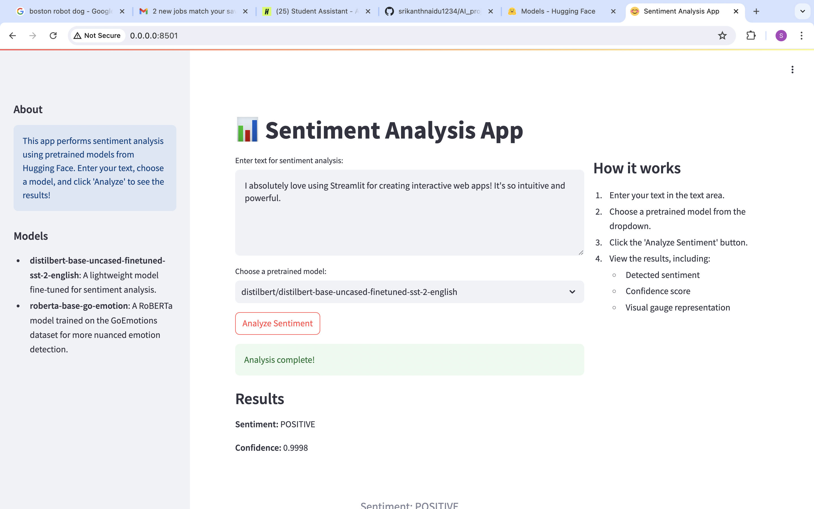

# Sentiment Analysis App

This Streamlit app performs sentiment analysis using pretrained models from Hugging Face. Users can enter text, choose a model, and analyze the sentiment with visualized results.

## Features

- Sentiment analysis using state-of-the-art NLP models
- Interactive web interface built with Streamlit
- Visual representation of sentiment scores using gauge charts
- Support for multiple pretrained models

## Installation

1. Clone this repository
2. Install the required packages:
3. Set up your Hugging Face token:
   - Create a `.env` file in the project root
   - Add your Hugging Face token: `HUGGINGFACE_TOKEN=your_token_here`

## Usage

Run the Streamlit app: stream run app.py
In Docker image build: docker build -t sentiment-analysis-app .
Docker run: docker run -p 8501:8501 -m 1g sentiment-analysis-app

Then open your web browser and navigate to the provided local URL (usually `http://localhost:8501`).

### Sentiment Analysis App Screenshot

## How It Works

1. Enter your text in the provided text area.
2. Choose a pretrained model from the dropdown menu.
3. Click the "Analyze Sentiment" button.
4. View the results, including:
   - Detected sentiment
   - Confidence score
   - Visual gauge representation

## Supported Models

- **distilbert-base-uncased-finetuned-sst-2-english**: A lightweight model fine-tuned for sentiment analysis.
- **roberta-base-go-emotion**: A RoBERTa model trained on the GoEmotions dataset for more nuanced emotion detection.

## Dependencies

- streamlit
- plotly
- transformers
- python-dotenv
- huggingface_hub

## Contributing

Contributions are welcome! Please feel free to submit a Pull Request.

## License

This project is licensed under the MIT License - see the [LICENSE](LICENSE) file for details.
