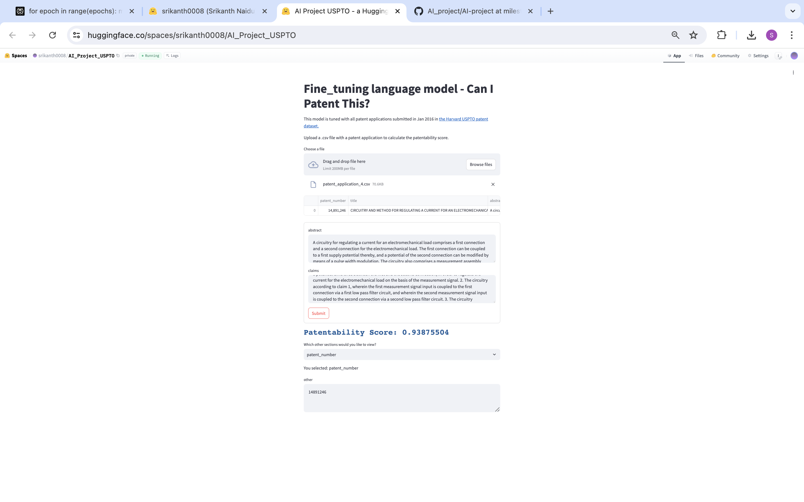

# Patent Patentability Predictor

This project uses a fine-tuned language model to predict the patentability of patent applications based on their abstract and claims. The model is trained on a subset of the Harvard USPTO patent dataset , specifically focusing on patent applications submitted in January 2016.

## Hugging Face Space

The application is deployed as a Hugging Face Space. You can access and use the app here:

[Patent Patentability Predictor App](https://huggingface.co/spaces/srikanth0008/AI_Project_USPTO)

## How to Use

1. Open the Hugging Face Space link above.
2. upload the a patent appplication sample present in Harvard USPTO patent dataset as csv file or any patent application with abstract and claims.
3. From the dropdown menu, select a patent application filing number.
4. The abstract and claims of the selected patent application will be displayed in two separate text boxes.
5. Click the "Submit" button to get the patentability score for the selected patent application.

## Model Details

- Base Model: DistilBERT (distilbert-base-uncased)
- Fine-tuned on: Subset of Harvard USPTO patent dataset (January 2016 applications)
- Input: Patent abstract and claims
- Output: Patentability score

## Repository Structure

- `AI_USPTO_milestone_3_Srikanth_Naidu.ipynb`: Script for fine-tuning the model
- `app_milestone_3.py`: Streamlit app for the Hugging Face Space
- `pyproject.toml`: Required Python packages
- `hugging face has the model stored which is finetuned`: Directory containing the fine-tuned model

### Patent Patentability Predictor App Screenshot from Huggingface Space

## Contributors

- [Srikanth Naidu]

## License

This project is licensed under the MIT License - see the LICENSE file for details.

